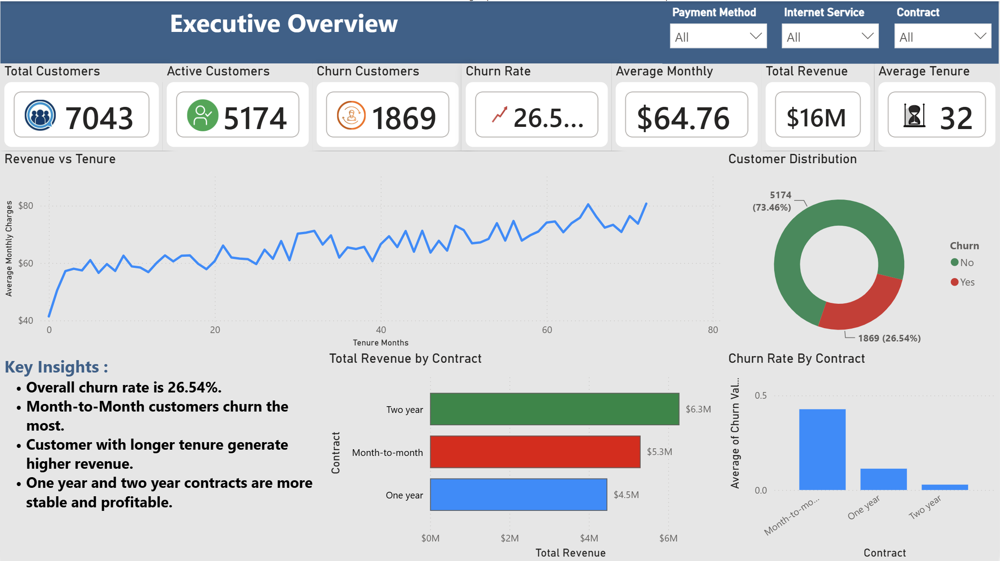
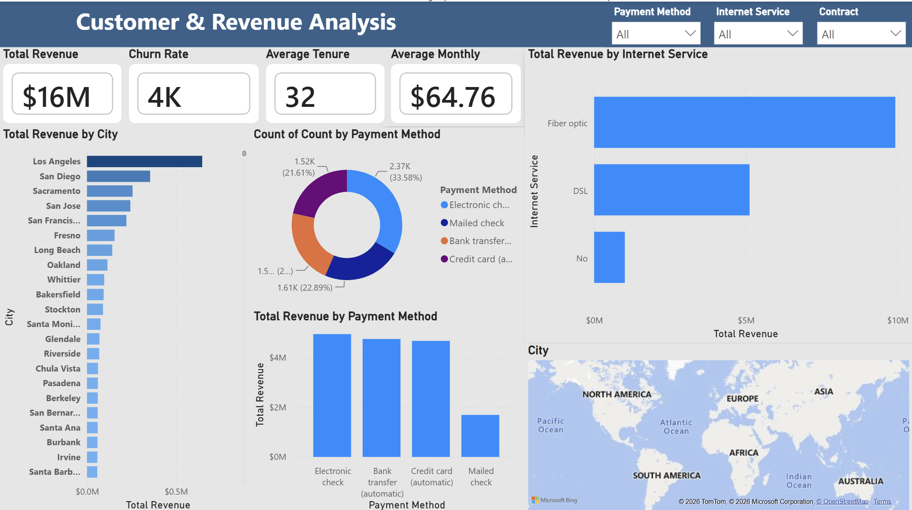
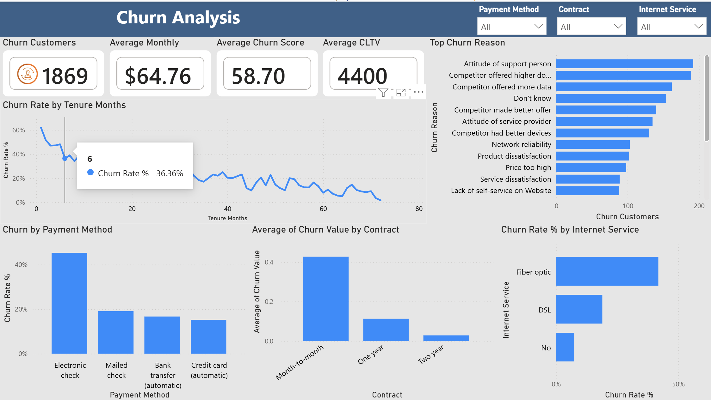
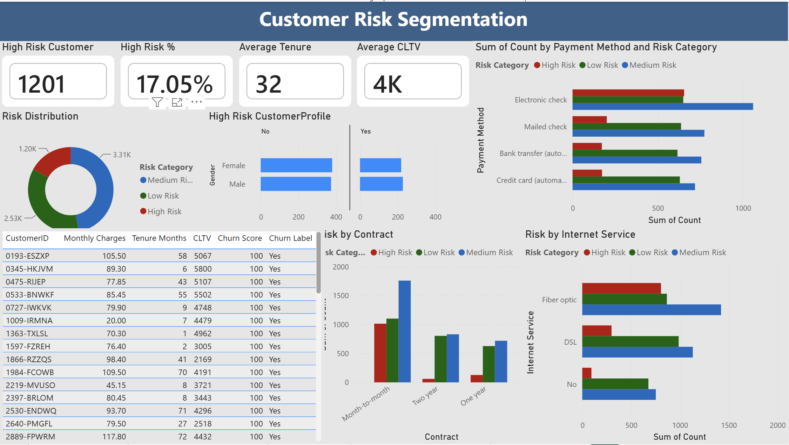

# 📊 Customer Intelligence & Growth Analytics

<p align="center">


</p>

---

# 📌 Project Overview

This project presents an **end-to-end Customer Intelligence & Growth Analytics solution** for a telecom company. It demonstrates the complete analytics lifecycle, from **data cleaning and SQL analysis** to **interactive Power BI dashboards** and **business recommendations**.

---

# 🚀 Project Workflow

```text
Excel Dataset
      │
      ▼
SQL Server
(Database & Business Analysis)
      │
      ▼
Python
(Data Cleaning & EDA)
      │
      ▼
Power BI
(Interactive Dashboard)
      │
      ▼
Executive Business Report
```

---

# 🛠 Tech Stack

| Technology | Purpose |
|------------|---------|
| SQL Server | Database & SQL Analysis |
| Python | Data Cleaning & EDA |
| Pandas | Data Manipulation |
| NumPy | Numerical Analysis |
| Matplotlib | Visualization |
| Seaborn | Statistical Charts |
| Power BI | Dashboard Development |
| Excel | Raw Dataset |

---

# 📊 Dashboard Preview

## Executive Overview



---

## Customer & Revenue Analysis



---

## Churn Analysis



---

## Customer Risk Segmentation



---

## Executive Recommendations


---

# 📈 Key Business Insights

✅ Month-to-Month customers have the highest churn rate.

✅ Fiber Optic customers contribute the largest share of high-risk customers.

✅ Electronic Check users churn significantly more than customers using automatic payment methods.

✅ Most churn occurs during the early customer lifecycle.

✅ Competitor offers and customer service issues are the leading churn drivers.

---

# 🎯 Business Recommendations

- Promote long-term contracts through targeted discounts.
- Improve Fiber Optic customer experience.
- Encourage Auto Pay adoption.
- Focus retention campaigns on new customers.
- Personalize offers for high-risk customers.

---

# 📂 Project Structure

```text
Customer-Intelligence-Growth-Analytics/
│
├── data/
├── sql/
├── python/
├── powerbi/
├── report/
├── images/
├── README.md
└── requirements.txt
```

---

# 💼 Skills Demonstrated

- SQL Server
- Python
- Power BI
- Data Cleaning
- Data Visualization
- Customer Analytics
- Churn Analysis
- Business Intelligence
- Dashboard Design
- Business Storytelling

---

# 👨‍💻 Author

**Kanhu Charan Mishra**

MCA Student | Data Analyst

GitHub: https://github.com/kanhumishra

LinkedIn: *(Add Your LinkedIn URL)*

---

⭐ If you found this project useful, consider giving it a star!
